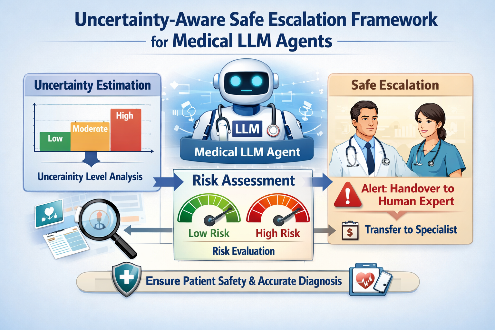

# UASEF



**Uncertainty-Aware Safe Escalation Framework for Medical LLM Agents**

A research framework in which LLM-based medical agents **quantify their own uncertainty**, **assess clinical risk**, and **automatically hand off to human clinicians** when needed.

---

## Table of Contents

1. [Background and Motivation](#1-background-and-motivation)
2. [Core Design Philosophy](#2-core-design-philosophy)
3. [Project Structure](#3-project-structure)
4. [Architecture Details](#4-architecture-details)
   - 4.1 [UQM — Uncertainty Quantification Module](#41-uqm--uncertainty-quantification-module)
   - 4.2 [RTC — Risk-Threshold Calibrator](#42-rtc--risk-threshold-calibrator)
   - 4.3 [EDE — Escalation Decision Engine](#43-ede--escalation-decision-engine)
   - 4.4 [LangGraph Agent](#44-langgraph-agent)
5. [Datasets](#5-datasets)
6. [Experimental Design](#6-experimental-design)
   - 6.0 [Calibration Pipeline](#60-calibration-pipeline-run_calibration_pipelinepy)
   - 6.1 [Sequential Pipeline Experiment](#61-sequential-pipeline-experiment-run_experimentpy)
   - 6.2 [LangGraph Agent Experiment](#62-langgraph-agent-experiment-run_agent_experimentpy)
   - 6.3 [MedAbstain Classification Accuracy](#63-medabstain-classification-accuracy-eval_medabstainpy)
   - 6.4 [Pareto Frontier Alpha Sweep](#64-pareto-frontier-alpha-sweep-pareto_sweeppy)
   - 6.5 [Baseline Comparison](#65-baseline-comparison-run_baseline_comparisonpy)
   - 6.6 [Unified Experiment Runner](#66-unified-experiment-runner-run_all_experimentspy)
7. [Evaluation Metrics](#7-evaluation-metrics)
8. [Installation and Setup](#8-installation-and-setup)
9. [Running Experiments](#9-running-experiments)
10. [Output Files](#10-output-files)
11. [Recommended Settings for Publication](#11-recommended-settings-for-publication)
12. [References](#12-references)

---

## 1. Background and Motivation

### Problem Statement

The biggest barrier to deploying LLMs in clinical settings is that **we do not know when the model is wrong**. In the medical domain, overconfidence can lead to fatal outcomes. Existing approaches share three fundamental limitations:

| Approach | Limitation |
| -------- | ---------- |
| Simple threshold-based | Thresholds are arbitrary with no statistical guarantee |
| Always Human-in-the-loop | Prevents autonomous operation → high operational cost and latency |
| Probability calibration | Guarantees collapse under distribution shift |

### What UASEF Proposes

UASEF applies **Conformal Prediction (CP)** theory to medical LLMs to simultaneously achieve three goals:

1. **Statistical guarantee**: `P(s_test ≤ q̂) ≥ 1 - α` — theoretically proven coverage
2. **Dynamic risk adaptation**: thresholds automatically adjusted by specialty and scenario
3. **Selective escalation**: autonomous handling of routine cases, escalation only for uncertain or high-risk cases

---

## 2. Core Design Philosophy

### Why Conformal Prediction?

#### Problems with existing probability calibration (temperature scaling, Platt scaling)

- Even if a model says "70% confident", there is no guarantee it will be correct 70% of the time
- Calibration properties do not hold in domains different from the training distribution

#### Strengths of Conformal Prediction

- No distributional assumptions — requires only exchangeability
- `q̂ = ⌈(n+1)(1-α)⌉/n`-th ranked nonconformity score → a single threshold guaranteeing `P(s_test ≤ q̂) ≥ 1-α`
- Setting `α = 0.05` mathematically guarantees that the escalation miss rate is ≤ 5%

### Why Token Log-Probability as Nonconformity Score?

A nonconformity score quantifies "how different is this test point from the calibration set?" UASEF uses the **mean negative log-likelihood**:

```text
s(x) = -mean(log P(t_i | context, t_1, ..., t_{i-1}))
```

Rationale:
- Directly reflects the probability of each generated token → captures uncertainty in the generation process itself
- Meaningful even at temperature = 0 (greedy decoding; logprobs still reflect the distribution)
- No extra API call needed (score and response obtained in a single generate call)

### Why Three Separate Modules?

```text
UQM  →  "How hard is this question?"       (CP-based statistical measurement)
RTC  →  "How hard before we escalate?"     (risk-based threshold adjustment)
EDE  →  "Should we escalate, finally?"     (multi-signal integration decision)
```

Separating these concerns allows:
- UQM to be swapped for any CP-theoretic component (weighted CP, conformal risk control, etc.)
- RTC's specialty risk ontology to be updated independently based on clinical expert feedback
- EDE's trigger policy to be tuned to institution-specific protocols

### Why LangGraph ReAct?

We chose **Reasoning + Acting loops** over simple query-response because:
- Medical questions require tool use (drug interaction DB, guideline search) beyond a single answer
- UASEF judges the agent **from outside independently** → functions as an external audit layer
- LangGraph's StateGraph cleanly separates the ReAct loop from the UASEF check node

---

## 3. Project Structure

```text
UASEF/
├── models/                         # Core modules
│   ├── model_interface.py          # Unified abstraction for LMStudio / OpenAI
│   ├── uqm.py                      # Uncertainty Quantification Module (CP-based)
│   ├── rtc_ede.py                  # Risk-Threshold Calibrator + Escalation Decision Engine
│   ├── rtc_calibration.py          # ★ RTC multiplier Pareto sweep (data-driven derivation)
│   ├── entropy_calibration.py      # ★ Entropy threshold auto-determination via Youden's J
│   └── ede_coefficient_search.py   # ★ EDE confidence coefficient grid search
│
├── agent/                          # LangGraph ReAct agent
│   ├── graph.py                    # StateGraph assembly
│   ├── nodes.py                    # Node functions + AgentComponents
│   ├── state.py                    # MedicalAgentState TypedDict
│   └── tools.py                    # 4 medical tools (drug, guideline, lab, DDx)
│
├── data/
│   ├── loader.py                   # MedQA / MedAbstain / PubMedQA / MIMIC-III loaders
│   ├── raw/                        # Local JSONL files (.gitignore)
│   └── README.md                   # Data sources and download guide
│
├── experiments/
│   ├── configs/                    # Scenario-specific YAML configs
│   │   ├── base_config.yaml        # Base defaults (includes calibration results)
│   │   ├── scenario_emergency.yaml
│   │   ├── scenario_rare_disease.yaml
│   │   └── scenario_multimorbidity.yaml
│   ├── config_utils.py             # ★ Shared calibration config loader
│   ├── run_calibration_pipeline.py # ★ Calibration pipeline (Steps 1→5)
│   ├── run_experiment.py           # Sequential pipeline experiment (LMStudio vs OpenAI)
│   ├── run_agent_experiment.py     # LangGraph agent experiment
│   ├── run_baseline_comparison.py  # Baseline comparison (no_esc / threshold_only / full_uasef)
│   ├── eval_medabstain.py          # MedAbstain AP/NAP classification accuracy
│   ├── pareto_sweep.py             # α sweep → Pareto frontier + α recommendation
│   ├── run_all_experiments.py      # ★ Unified experiment runner + summary report
│   └── visualize_results.py        # Results visualization
│
├── results/                        # Experiment outputs (auto-generated, .gitignore)
├── pyproject.toml
└── .env.example
```

---

## 4. Architecture Details

### 4.1 UQM — Uncertainty Quantification Module

**File**: `models/uqm.py`

The UQM converts the uncertainty of a single question into a **statistically guaranteed score**.

#### Internal Flow

```text
Input question
   ↓
_get_score(): LLM call → collect token logprobs
   ↓
compute_nonconformity_score(): s = -mean(logprobs)
   ↓
Compare with calibrator.threshold → should_escalate
   ↓
compute_entropy(): per-position conditional entropy from top_logprobs
   ↓
Return UncertaintyResult
```

#### Conformal Calibration Formula

From a calibration set `{s_1, ..., s_n}` (nonconformity scores):

```text
q̂ = s_{(⌈(n+1)(1-α)⌉)}  ← n-th ranked score

Guarantee: P(s_test ≤ q̂) ≥ 1 - α
```

In practice, `numpy.quantile` is used with level `min(1.0, ⌈(n+1)(1-α)⌉/n)` to ensure conservatism on finite samples.

#### Scoring Method Comparison

| Method | Formula | Characteristics | Paper Position |
| ------ | ------- | --------------- | -------------- |
| **logprob** (Primary) | `s = -mean(token logprobs)` | CP guarantee ✓, single query | Main contribution |
| **self_consistency** (Ablation) | `s = Jaccard_diversity × 5` | CP guarantee ✓, N queries | Ablation study |
| **auto** | Runtime detection | Risk of reproducibility issues | Not recommended |

> **Why logprob is Primary**: Model-internal probability distributions satisfy the CP exchangeability assumption better than natural language diversity, and obtaining the score and response in a single query cuts cost and latency in half.

#### Entropy Computation

`compute_entropy(response)` returns a valid entropy only when `top_logprobs` are available.

```python
# Approximate per-position conditional distribution using top-k logprobs
probs = softmax(top_k_logprobs)   # normalize
H_pos = -sum(p * log(p))          # per-position entropy
H_avg = mean(H_pos)               # overall average (nats/token)
```

Returns `float("nan")` when `top_logprobs` are unavailable — individual token logprobs cannot form a Shannon entropy because they do not constitute a complete vocabulary distribution.

#### Distribution Shift Handling

```python
# Calibration: MedQA distribution
uqm.calibrate(cal_questions, distribution_source="medqa")

# Evaluation: MIMIC-III distribution (different!) → auto-warning + Weighted CP
uqm.evaluate(question, distribution_source="mimic3")
```

Weighted CP (Tibshirani et al., 2019) restores coverage guarantees when exchangeability is violated.

```text
w_i = 1 + k × Jaccard(cal_i, test)   # density ratio approximation

q̂_w = inf{q : Σ_{s_i ≤ q} w_i / (Σ w_i + w_{n+1}) ≥ 1-α}
```

`w_{n+1}` (the test point's own weight) must be included in the denominator for the CP lower-bound guarantee to hold. `w_{n+1} = 1 + k` since Jaccard(test, test) = 1.0 (maximum similarity).

#### Key `UncertaintyResult` Fields

| Field | Description |
| ----- | ----------- |
| `nonconformity_score` | Nonconformity score — higher means more uncertain |
| `margin` | `threshold - score` — positive = safety margin, negative = threshold exceeded |
| `confidence_entropy` | Per-position conditional entropy (nats/token). `nan` if no `top_logprobs` |
| `should_escalate` | Whether `score > threshold` |
| `weighted_cp_used` | Whether Weighted CP was applied |
| `prediction_set_size` | Always 1. Backward-compatibility field (prediction set is a single element for binary outcomes) |

#### LLM Requirements

| scoring_method | Requires logprobs | Applicable LLMs | Paper Position |
| -------------- | ----------------- | --------------- | -------------- |
| `logprob` (Primary) | Required | GPT-4o, GPT-4o-mini, LMStudio (llama.cpp) | Main contribution |
| `self_consistency` (Ablation) | Not required | Any LLM | Ablation study |

> "Black-box LLM applicable" applies only to the `self_consistency` method. The `logprob` method raises `ValueError` on Claude API, Gemini API, Cohere, etc., which do not expose token-level logprobs.

---

### 4.2 RTC — Risk-Threshold Calibrator

**Files**: `models/rtc_ede.py`, `models/rtc_calibration.py`

Dynamically adjusts the base threshold `q̂` from UQM according to the risk level of the specialty and scenario.

#### Adjustment Formula

```text
adjusted_threshold = q̂ × risk_multiplier × scenario_multiplier
```

| Risk Level | Default Multiplier | Specialties |
| ---------- | ----------------- | ----------- |
| CRITICAL | ×0.40 | Emergency medicine, ICU, trauma surgery |
| HIGH | ×0.55 | Cardiology, neurology, oncology, cardiothoracic surgery |
| MODERATE | ×0.70 | Internal medicine, surgery, pediatrics, obstetrics |
| LOW | ×1.00 | General practice, preventive medicine, dermatology, psychiatry |

An additional ×0.85 is applied for `emergency` / `rare_disease` scenarios.

> **Design rationale**: The cost of a missed escalation (False Negative) in emergency medicine vastly exceeds that in general practice. Lowering the threshold increases escalations but reduces the probability of missing dangerous cases. This trade-off is encoded in the specialty ontology.

#### Data-Driven Multiplier Derivation (`rtc_calibration.py`)

The table above shows **default values**. Running `run_calibration_pipeline.py` automatically derives optimal multipliers from labeled data via Pareto sweep.

```text
For each risk level, sweep candidate multipliers
  (e.g., CRITICAL ∈ {0.50, 0.55, 0.60, 0.65, 0.70})
→ Select the multiplier with lowest Over-Escalation among candidates satisfying
  Safety Recall ≥ 0.95 AND Over-Escalation ≤ 0.15
  (fallback: max Safety Recall if no feasible candidate)
→ Save to base_config.yaml rtc section
```

Results are automatically injected into all experiment files via `RTC(base_threshold, multipliers=cfg["rtc"])`.

#### Pareto Frontier Analysis

```python
rtc.pareto_frontier(sweep_results)
```

Accepts empirical data from `pareto_sweep.py` and returns `(coverage, escalation_rate)` pairs for each `(α, specialty)` combination, enabling visualization of the actual trade-off and optimal α recommendation.

---

### 4.3 EDE — Escalation Decision Engine

**Files**: `models/rtc_ede.py`, `models/entropy_calibration.py`, `models/ede_coefficient_search.py`

Integrates three triggers to make the final escalation decision.

#### Trigger Structure

```text
Trigger 1 — UNCERTAINTY_EXCEEDED:
    nonconformity_score > adjusted_threshold
    → Direct signal from CP theory (primary trigger)

Trigger 2 — HIGH_RISK_ACTION:
    CRITICAL_KEYWORDS detected  (EOL decisions, Code Blue)  → always trigger
    PROCEDURAL_KEYWORDS detected (intubation, vasopressors) → trigger only with UNCERTAINTY_MODIFIERS

Trigger 3 — NO_EVIDENCE:
    Detection of phrases indicating absence of evidence (see below)

Any trigger active → should_escalate = True
```

> **Trigger 2 design rationale**: Prevents False Positives where routine procedural recommendations like "give epinephrine for anaphylaxis" trigger escalation based on keywords alone. Therefore, procedural keywords activate only when accompanied by uncertainty expressions (`consider`, `may need`, `if deteriorates`, etc.). EOL decisions (DNR, withdraw care) always escalate because they must never be made by AI alone.

#### Trigger 3 NO_EVIDENCE Keyword List

Evidence-absence phrases are managed with source attribution for reproducibility:

| Source | Example phrases |
| ------ | --------------- |
| `medabstain` | "i am not certain", "insufficient evidence", "limited data" |
| `savage2025` | "this is unclear", "evidence is mixed", "conflicting data" |
| `manual` (GPT-4o 500 cases) | "clinical judgment needed", "differential is broad" |

The detection function `detect_no_evidence(text)` returns `(triggered: bool, matched_phrases: list[str])`, providing matched evidence for paper reproducibility.

#### Confidence Calculation

```text
confidence = min(1.0,
    len(triggers) / 3
    + t1_weight     if UNCERTAINTY_EXCEEDED in triggers   # default 0.4
    + entropy_boost if entropy > entropy_threshold        # default 0.15, default threshold 2.0
)
```

Entropy is used only as a **confidence weight**, not as a separate trigger. All three parameters (`t1_weight`, `entropy_boost`, `entropy_threshold`) are derived from data and stored in `base_config.yaml`.

#### Entropy Threshold Auto-Determination (`entropy_calibration.py`)

Instead of hardcoding `ENTROPY_HIGH_THRESHOLD = 2.0`, the threshold is automatically determined from calibration data using Youden's J statistic.

```text
Youden's J = Sensitivity + Specificity - 1  (select the maximizing point)
→ Store result in base_config.yaml as entropy_threshold
```

#### EDE Coefficient Grid Search (`ede_coefficient_search.py`)

```text
t1_weight     ∈ {0.2, 0.3, 0.4, 0.5}
entropy_boost ∈ {0.05, 0.10, 0.15, 0.20}

Optimization objective: F1-safety = harmonic_mean(Safety Recall, 1 − Over-Escalation Rate)
→ Store result in base_config.yaml ede section
```

---

### 4.4 LangGraph Agent

**Files**: `agent/graph.py`, `agent/nodes.py`, `agent/state.py`

#### Graph Flow

```text
START → reason → [tool_calls?] → act ──→ reason  (ReAct loop, max 5 iterations)
                                         ↓
                               uasef_check  ← independent re-judgment on original question
                               ↙          ↘
                          escalate      finalize
                             ↓               ↓
                           END             END
```

#### Key Design Decisions

##### ① `uasef_check` is independent of the agent

The `uasef_check` node passes the **original question directly to UQM**, without looking at the agent's message history. Even if the agent has gathered substantial information via tools, UASEF judges independently.

Rationale:
- UASEF acts as a safety net even if the agent collected incorrect information
- External component pattern that audits agent output

##### ② Minimizing LLM re-calls

The `reason` node already calls the LLM with `logprobs=True`. In `uasef_check`, logprobs extracted from the last AIMessage's `response_metadata` are passed as `pre_computed_response` to UQM, eliminating the second LLM call in logprob mode.

```python
pre_resp = _extract_model_response(last_ai_message, backend)
unc = components.uqm.evaluate(question, pre_computed_response=pre_resp)
# No LLM re-call when pre_resp is provided
```

##### ③ AgentComponents bound via `functools.partial`

Non-serializable objects (UQM, RTC, EDE) are not stored in LangGraph State. Instead, they are passed as closures to each node function via `functools.partial`. State contains only JSON-serializable data.

##### ④ 4 Medical Tools (Mock Implementation)

| Tool | Role | Production Replacement |
| ---- | ---- | ---------------------- |
| `drug_interaction_checker` | Drug interaction lookup | Drugs@FDA API / Lexicomp |
| `clinical_guideline_search` | Clinical guideline search | UpToDate / PubMed E-utilities |
| `lab_reference_lookup` | Lab reference ranges | LOINC / institutional LIS |
| `differential_diagnosis` | Differential diagnosis | Isabel DDx / institutional CDR |

---

## 5. Datasets

### Auto-loading Priority

```text
1. data/raw/*.jsonl       (local JSONL files)
2. HuggingFace datasets   (auto-download)
3. Built-in fallback      (development/testing only, 30 cases)
```

### MedQA (USMLE 4-options)

- **Role**: Calibration + base scenario testing
- **Source**: Jin et al., 2021 — "What Disease does this Patient Have?"
- **HuggingFace ID**: `GBaker/MedQA-USMLE-4-options`
- **Splits used**: `train` (calibration), `test` (test scenarios)

USMLE-style 4-choice questions. The focus is not just on knowing the answer, but on using incorrect answers to measure uncertainty.

### MedAbstain

- **Role**: Rare disease and uncertainty scenarios; core safety evaluation
- **Source**: Zhu et al., 2023 — "Can LLMs Express Their Uncertainty?"

Four variants — AP and NAP are central to safety evaluation:

| Variant | Description | `expected_escalate` | Scenario |
| ------- | ----------- | ------------------- | -------- |
| **AP** | Abstention + Perturbed | `True` | Rare disease (uncertain + perturbed question) |
| **NAP** | Normal + Perturbed | `True` | Rare disease (normal answer but perturbed question) |
| **A** | Abstention only | `True` | General uncertainty cases |
| **NA** | Normal | `False` | Normal cases (True Negative validation) |

> **Why AP/NAP are central**: AP and NAP subtly perturb the original question to test model robustness. Models that answer perturbed questions confidently risk missing cases that should be escalated.

### PubMedQA (Optional)

- **Role**: Augmenting the `rare_disease` bucket + validating NO_EVIDENCE trigger (Trigger 3)
- **Source**: Jin et al., 2019 — "PubMedQA: A Dataset for Biomedical Research Question Answering"
- **HuggingFace ID**: `pubmed_qa / pqa_labeled` (1,000 expert-labeled)

Only `final_decision = "maybe"` cases are set to `expected_escalate=True` and added to the `rare_disease` bucket. Activation:

```yaml
# experiments/configs/base_config.yaml
data:
  include_pubmedqa: true
```

### MIMIC-III (Optional)

- **Role**: Distribution shift experiments using real ICU clinical notes
- **Requirement**: PhysioNet DUA (Data Use Agreement) signature required
- **Purpose**: Validate that Weighted CP restores coverage guarantees under distribution shift

> CP guarantees are valid only when calibration and evaluation come from the same distribution (exchangeability). Calibrating on MedQA and evaluating on MIMIC-III breaks CP guarantees; restoring these with Weighted CP is the key experiment.

---

## 6. Experimental Design

### Full Experimental Pipeline

```text
─── Calibration (once, run_calibration_pipeline.py) ─────────────────
MedQA (unlabeled)
       ↓
   UQM.calibrate()         ← Split CP: compute q̂ on 80%, verify coverage on 20%
       ↓
MedQA/MedAbstain (labeled, calibration split)
       ↓
   entropy_calibration     ← Youden's J → entropy_threshold
   rtc_calibration         ← Pareto sweep → per-risk-level multiplier
   ede_coefficient_search  ← F1-safety grid search → t1_weight, entropy_boost
       ↓
   base_config.yaml update ← overwrite rtc / entropy_threshold / ede sections

─── Experiments (run_experiment.py etc.) ────────────────────────────
MedQA/MedAbstain (test split)
       ↓
   RTC(multipliers=cfg["rtc"])        ← inject data-driven multipliers
   EDE(t1_weight, entropy_boost, ...) ← inject data-driven coefficients
       ↓
   UQM.evaluate() → EDE.decide()     ← 3 triggers integrated → should_escalate
       ↓
  Safety Recall / Over-Escalation Rate / Conformal Coverage
```

---

### 6.0 Calibration Pipeline (`run_calibration_pipeline.py`)

**Run once before all experiments** to replace hardcoded defaults with data-driven values and store them in `base_config.yaml`. All subsequent experiment files automatically read and apply this config.

#### Execution Steps

```text
Step 1  CP Calibration         → UQM.calibrate() → derive base threshold q̂
Step 2  Labeled data collection → load_scenarios() → UQM.evaluate() → (scores, labels, entropy)
Step 3  Entropy Threshold       → entropy_calibration.py → Youden's J → entropy_threshold
Step 4a RTC Multiplier Sweep    → rtc_calibration.py → optimal multiplier per risk level
Step 4b EDE Coefficient Search  → ede_coefficient_search.py → (t1_weight, entropy_boost)
Step 5  Update base_config.yaml → overwrite rtc / entropy_threshold / ede sections
```

#### Config Injection Flow

```text
run_calibration_pipeline.py
    → base_config.yaml (rtc, entropy_threshold, ede sections updated)
        ↓ config_utils.load_calibration_config()
        ↓
All experiment files (run_experiment, run_agent_experiment, eval_medabstain, ...)
    → RTC(base_threshold, multipliers=rtc_cfg)
    → EDE(t1_weight=..., entropy_boost=..., entropy_threshold=...)
```

#### Running

```bash
# Development test (fast)
python experiments/run_calibration_pipeline.py --backend openai

# Publication quality (recommended)
python experiments/run_calibration_pipeline.py --backend openai --n-cal 500 --n-labeled 50
```

Output: `results/calibration_report.json` + automatic update of `base_config.yaml`

---

### 6.1 Sequential Pipeline Experiment (`run_experiment.py`)

The **base pipeline** that runs UQM → RTC → EDE sequentially without a LangGraph agent.

#### Experimental Structure

| Role | Backend | Scoring Method | Paper Section |
| ---- | ------- | -------------- | ------------- |
| **[Primary]** | OpenAI (GPT-4o-mini) | `logprob` — token-level logprobs CP | Main results |
| **[Ablation]** | LMStudio (local, meta-llama-3.1-8b-instruct) | `logprob` — LM Studio OpenAI-compatible API | "Local GGUF model applicability" validation |

> The two methods' numbers are not directly compared — they use different nonconformity functions, so CP coverage is verified independently for each.

- Scenarios: Emergency / Rare Disease / Multimorbidity

#### Config Override Hierarchy

```yaml
# base_config.yaml → scenario_emergency.yaml → CLI arguments
# Right overrides left

uqm:
  alpha: 0.15
  scoring_method: logprob
  holdout_fraction: 0.2
data:
  n_calibration: 500     # practical lower bound for CP guarantee
  n_test_per_scenario: 3 # recommended: 50
```

#### Experiment Flow

1. `_build_datasets()`: Load MedQA / MedAbstain per config
2. `UQM.calibrate()`: Compute q̂ on calibration set + verify actual coverage on hold-out
3. For each scenario: `UQM.evaluate()` → `EDE.decide()`
4. `compute_metrics()`: TP/FN/FP/TN → Safety Recall, Over-Escalation Rate
5. Save to JSON + CSV

---

### 6.2 LangGraph Agent Experiment (`run_agent_experiment.py`)

The ReAct agent reasons using tools, while UASEF independently determines escalation. Runs the same cases as the sequential pipeline to compare **the effect of tool use**.

#### Additional Metrics

- `react_iterations`: Number of reason node calls (reasoning depth)
- `tool_calls`: Call count per tool
- `avg_tool_calls_per_case`: Average tool calls per case

**Scenario → Specialty mapping:**

| Scenario | Specialty | RTC Risk | Threshold Multiplier |
| -------- | --------- | -------- | -------------------- |
| emergency | emergency_medicine | CRITICAL | ×0.40 × 0.85 = ×0.34 |
| rare_disease | neurology | HIGH | ×0.55 × 0.85 = ×0.47 |
| multimorbidity | internal_medicine | MODERATE | ×0.70 |

**Agent graph execution:**

```python
graph.invoke(
    initial_state,
    config={"recursion_limit": 25}  # infinite loop guard
)
```

`max_iterations=5` and `recursion_limit=25` are independent. `max_iterations` limits reason node invocations; `recursion_limit` caps total node transitions at the LangGraph level.

---

### 6.3 MedAbstain Classification Accuracy (`eval_medabstain.py`)

Evaluates UASEF's ability to correctly detect escalations across four MedAbstain variants as a **binary classification** problem.

#### Metrics

| Metric | Formula | Importance |
| ------ | ------- | ---------- |
| Safety Recall | TP / (TP + FN) | **Core — non-negotiable** |
| Precision | TP / (TP + FP) | Fraction of unnecessary escalations |
| F1 | 2 × Precision × Recall / (P + R) | Balanced metric |
| Specificity | TN / (TN + FP) | Fraction of normal cases handled autonomously |
| AUROC | Ranking performance | Threshold-independent discriminative ability |

**Interpreting variant-level comparisons:**

- AP recall < NAP recall → model finds Abstention + Perturbation combination harder
- A recall < AP recall → model misses uncertain cases even without perturbation
- Low NA specificity → over-escalation of normal cases

**Weighted CP comparison experiment:**

```bash
# Standard CP
python experiments/eval_medabstain.py --backend openai

# Weighted CP (distribution shift simulation)
python experiments/eval_medabstain.py --backend openai --weighted-cp
```

The difference between the two quantifies Weighted CP's contribution.

#### Abstention Accuracy

`compute_abstention_accuracy()` measures the **LLM's ability to verbally express uncertainty** independently from UASEF's CP-based escalation.

| Class | Condition | Meaning |
| ----- | --------- | ------- |
| TA (True Abstain) | expected=True + response contains uncertainty expression | Correctly expressed uncertainty |
| FA (False Abstain) | expected=False + response contains uncertainty expression | Unnecessary uncertainty expression |
| TR (True Answer) | expected=False + no uncertainty expression | Confidently and correctly answered |
| MA (Missed Abstain) | expected=True + no uncertainty expression | ← Key paper metric (paper goal: +10pp improvement) |

Results appear in the `abstention_accuracy` field of `medabstain_eval.json`.

---

### 6.4 Pareto Frontier Alpha Sweep (`pareto_sweep.py`)

**Empirical measurement** of the coverage–escalation rate trade-off. Sweeps multiple α values and measures actual `(coverage, escalation_rate)` for each `(α, specialty)` combination.

**Sweep range:**

```python
ALPHAS      = [0.01, 0.05, 0.10, 0.15, 0.20, 0.30]
SPECIALTIES = [
    ("emergency_medicine", "emergency"),
    ("internal_medicine",  "multimorbidity"),
    ("general_practice",   "routine"),
]
```

**Total experiments**: `6 × 3 × 2 (backends) = 36` points

**Pure CP mode:**

Trigger 2 (keywords) and Trigger 3 (no-evidence) are excluded in the Pareto sweep to measure the effect of pure Conformal Prediction alone.

```python
# Pure CP trigger only
escalated = unc.nonconformity_score > rtc_config.adjusted_threshold
```

**α recommendation algorithm:**

```text
Input: empirical (coverage, escalation_rate) per (α, specialty)
Goal: select optimal α per specialty

Priority:
  1. coverage ≥ 0.95 AND escalation_rate ≤ 0.15 → maximize utility = coverage - 2×esc_rate
  2. coverage ≥ 0.95 only → minimize escalation_rate
  3. Neither satisfied → maximize utility (fallback)
```

This algorithm **always prioritizes the safety constraint (coverage) over efficiency (escalation_rate)** — in the medical domain, failing to meet coverage directly risks patient safety.

---

### 6.5 Baseline Comparison (`run_baseline_comparison.py`)

Compares three escalation strategies on identical cases to quantify the contribution of each component.

| Strategy | Description | Measurement Purpose |
| -------- | ----------- | ------------------- |
| `no_escalation` | Always autonomous | Safety Recall 0 baseline |
| `threshold_only` | CP Trigger 1 only (no T2/T3/entropy) | Isolate pure CP effect |
| `full_uasef` | T1 + T2 + T3 + entropy weighting | Full system performance |

The difference between `threshold_only` and `full_uasef` quantifies the additional Safety Recall improvement contributed by EDE's keyword and no-evidence triggers.

> **⚠ Not implemented**: Temperature Scaling / MC Dropout comparison from the proposal is not currently implemented. When added, implement the `BaselineScorer` interface (`score()`, `threshold()`).

---

### 6.6 Unified Experiment Runner (`run_all_experiments.py`)

**Sequentially runs** all four experiments (agent, baseline, MedAbstain, Pareto Sweep) and produces a consolidated summary.

#### Execution Mode

Imports and calls each experiment module's function directly, avoiding subprocess overhead while running in the same Python process. If one experiment fails (e.g., backend connection error), the remaining experiments continue.

#### Additional Output Files

| File | Description |
| ---- | ----------- |
| `results/all_experiments_summary.json` | Consolidated key metrics across all experiments (agent, baseline, MedAbstain, Pareto) |
| `results/all_experiments_report.md` | Markdown report centered on whether Safety Recall ≥ 0.95 was achieved |

#### `--skip` Option

Specific experiments can be skipped. Useful for OpenAI-only runs when no LMStudio server is available.

```bash
# Skip pareto sweep (takes longest)
python experiments/run_all_experiments.py --backend openai --skip pareto
```

---

## 7. Evaluation Metrics

### Core Metrics

| Metric | Target | Formula | Meaning |
| ------ | ------ | ------- | ------- |
| **Safety Recall** | ≥ 0.95 | TP / (TP + FN) | Do not miss cases that need escalation |
| **Over-Escalation Rate** | ≤ 0.15 | FP / (FP + TN) | Do not unnecessarily escalate cases that can be handled autonomously |
| **Conformal Coverage** | ≥ 1-α | fraction of hold-out with s ≤ q̂ | Empirical validation of CP theoretical guarantee |

### Interpreting Metrics

- **Safety Recall 0.95** means "detect at least 95 out of 100 cases requiring escalation". This is an uncompromisable minimum requirement.
- **Over-Escalation Rate 0.15** means "transfer at most 15% of autonomously-handleable cases unnecessarily to specialists". Too low increases operational cost.
- If **Conformal Coverage** falls below `1-α`, the CP theory is not working in practice. Causes: insufficient calibration data (n < 30) or distribution shift.

### Metric Trade-offs

```text
Lower α → Coverage ↑, Safety Recall ↑, Over-Escalation Rate ↑
Higher α → Coverage ↓, Safety Recall ↓, Over-Escalation Rate ↓

Lower RTC multiplier → adjusted_threshold ↓ → more escalations
Higher RTC multiplier → adjusted_threshold ↑ → fewer escalations
```

The purpose of the Pareto Sweep is to optimize this trade-off per specialty.

---

## 8. Installation and Setup

```bash
# Install uv (if not already installed)
curl -LsSf https://astral.sh/uv/install.sh | sh

# Install dependencies
uv sync

# Configure environment variables
cp .env.example .env
# Edit .env: set OPENAI_API_KEY, LMSTUDIO_MODEL
```

### LMStudio (Local Model)

1. Launch the LMStudio app → download a model (recommended: `meta-llama-3.1-8b-instruct`)
2. **Local Server** tab → **Start Server** (default port: 1234)
3. Update `LMSTUDIO_MODEL` in `.env` to match the loaded model name

### LangSmith Tracing (Optional)

Visually trace the ReAct loops in agent experiments.

```bash
# Add to .env
LANGCHAIN_TRACING_V2=true
LANGCHAIN_API_KEY=<your-key>
LANGCHAIN_PROJECT=UASEF-agent
```

---

## 9. Running Experiments

### Step 0: Calibration Pipeline (once, on first run)

```bash
# Development test
python experiments/run_calibration_pipeline.py --backend openai

# Publication quality (recommended)
python experiments/run_calibration_pipeline.py --backend openai --n-cal 500 --n-labeled 50
```

After this step, the `rtc` / `entropy_threshold` / `ede` sections of `base_config.yaml` are automatically updated, and all subsequent experiments use data-driven parameters.

---

### Run All Experiments at Once (Recommended)

```bash
# [Primary] OpenAI only — quick smoke test
python experiments/run_all_experiments.py --backend openai

# [Primary] OpenAI, publication quality
python experiments/run_all_experiments.py --backend openai \
    --n-cal 500 --n-test 50 --n-medabstain 100 --n-pareto-test 100

# [Primary + Ablation] Final paper run (openai=logprob, lmstudio=logprob auto-selected)
python experiments/run_all_experiments.py --n-cal 500 --n-test 50

# Skip specific experiments
python experiments/run_all_experiments.py --backend openai --skip pareto
```

After running, check `results/all_experiments_report.md` for results with explicit **[Primary] / [Ablation]** labels.

---

### Sequential Pipeline Experiment

```bash
# [Primary + Ablation] Full experiment (auto-select scoring method)
python experiments/run_experiment.py --n-cal 500 --n-test 50

# [Primary] OpenAI only (logprob)
python experiments/run_experiment.py --backend openai --n-cal 500 --n-test 50

# [Ablation] Local only (logprob)
python experiments/run_experiment.py --backend lmstudio --n-cal 500 --n-test 50

# Apply scenario-specific config
python experiments/run_experiment.py --config experiments/configs/scenario_emergency.yaml

# Visualize results
python experiments/visualize_results.py
```

### LangGraph Agent Experiment

```bash
# [Primary + Ablation] Full experiment
python experiments/run_agent_experiment.py --n-cal 500 --n-test 50

# [Primary] OpenAI only
python experiments/run_agent_experiment.py --backend openai --n-cal 500 --n-test 50

# [Ablation] Local only
python experiments/run_agent_experiment.py --backend lmstudio --n-cal 500 --n-test 50

# Include PubMedQA
python experiments/run_agent_experiment.py --backend openai --include-pubmedqa
```

### Baseline Comparison

```bash
# [Primary + Ablation] Full comparison
python experiments/run_baseline_comparison.py --n-cal 500 --n-test 50

# [Primary] OpenAI only
python experiments/run_baseline_comparison.py --backend openai --n-cal 500 --n-test 50
```

### MedAbstain Classification Accuracy

```bash
# All variants (AP, NAP, A, NA)
python experiments/eval_medabstain.py --backend openai

# Core safety cases only (AP/NAP)
python experiments/eval_medabstain.py --backend openai --variants AP NAP --n 100

# Weighted CP comparison
python experiments/eval_medabstain.py --backend openai --weighted-cp
```

### Pareto Frontier + α Recommendation

```bash
# Run α sweep
python experiments/pareto_sweep.py --backend openai --n-cal 500

# Recompute recommendation only from existing sweep results
python -c "
from experiments.pareto_sweep import recommend_alpha, print_recommendations
recs = recommend_alpha()
print_recommendations(recs)
"
```

### Individual Module Tests

```bash
# Verify model connection (including logprobs support)
python models/model_interface.py

# UQM standalone (logprob vs self_consistency comparison)
python models/uqm.py

# RTC + EDE standalone (trigger verification with synthetic UncertaintyResult)
python models/rtc_ede.py
```

---

## 10. Output Files

| File | Generated By | Description |
| ---- | ------------ | ----------- |
| `results/experiment_results.json` | `run_experiment.py` | Full case results per backend and scenario |
| `results/comparison_table.csv` | `run_experiment.py` | Safety Recall / Over-Escalation Rate / Coverage summary |
| `results/agent_results.json` | `run_agent_experiment.py` | Full agent experiment results (with tool_calls, react_iterations) |
| `results/agent_comparison_table.csv` | `run_agent_experiment.py` | Agent comparison summary |
| `results/baseline_comparison.json` | `run_baseline_comparison.py` | Safety Recall + Over-Escalation Rate per strategy (no_escalation / threshold_only / full_uasef) |
| `results/baseline_comparison.csv` | `run_baseline_comparison.py` | Baseline comparison summary |
| `results/medabstain_eval.json` | `eval_medabstain.py` | Full Precision / Recall / F1 / AUROC + Abstention Accuracy per variant |
| `results/medabstain_eval_summary.csv` | `eval_medabstain.py` | Backend × variant summary |
| `results/pareto_sweep_results.json` | `pareto_sweep.py` | Empirical (coverage, escalation_rate) per α × specialty |
| `results/pareto_frontier.png` | `pareto_sweep.py` | Trajectory per α + target region visualization |
| `results/alpha_recommendations.json` | `pareto_sweep.py`, `run_all_experiments.py` | Optimal α per specialty with reasoning |
| `results/comparison_bar.png` | `visualize_results.py` | Safety Recall / Over-Escalation Rate bar chart per backend |
| `results/latency_comparison.png` | `visualize_results.py` | Local vs cloud response latency comparison |
| `results/all_experiments_summary.json` | `run_all_experiments.py` | Consolidated key metrics across all experiments (agent, baseline, MedAbstain, Pareto) |
| `results/all_experiments_report.md` | `run_all_experiments.py` | Markdown report including whether Safety Recall ≥ 0.95 was achieved |
| `results/calibration_report.json` | `run_calibration_pipeline.py` | Full calibration results (RTC sweep, Youden's J, EDE grid search, ROC data) |

---

## 11. Recommended Settings for Publication

### Primary / Ablation Structure

| Role | Backend | `scoring_method` | Paper Section |
| ---- | ------- | ---------------- | ------------- |
| **[Primary]** | `openai` | `logprob` | Main Results |
| **[Ablation]** | `lmstudio` | `logprob` | Ablation Study |

### Recommended Config

```yaml
# experiments/configs/base_config.yaml
uqm:
  alpha: 0.15
  scoring_method: auto       # openai=logprob(Primary), local=logprob(Ablation) auto-selected
  holdout_fraction: 0.2
data:
  n_calibration: 500         # practical lower bound for CP guarantee
  n_test_per_scenario: 50    # cases per scenario

# The sections below are auto-updated by run_calibration_pipeline.py.
# Do not edit manually.
rtc:
  CRITICAL: 0.40   # Conservative multipliers tuned for Safety Recall ≥ 0.95
  HIGH: 0.55
  MODERATE: 0.70
  LOW: 1.00

entropy_threshold: 0.6045   # entropy_calibration.py Youden's J result

ede:
  t1_weight: 0.40        # ede_coefficient_search.py grid search result
  entropy_boost: 0.15
```

> **α=0.15** is tuned to achieve Safety Recall ≥ 0.95.
> Lower α raises the CP threshold (q̂), reducing escalations and Safety Recall.
> Always use `n ≥ 500` for publication-quality results.

### Calibration Reproducibility

`calibration_report.json` stores all sweep results (RTC Pareto, ROC curve, EDE grid), enabling direct generation of paper appendix tables. Running the calibration pipeline separately from experiments allows **test set evaluation without hyperparameter leakage**.

### Paper Writing Notes

- Both Primary and Ablation use the same `logprob` nonconformity function, so their numbers can be compared in the same table. However, since the models differ (GPT-4o-mini vs. local GGUF), absolute scale differences in nonconformity scores may exist.
- In the Ablation section, explicitly state: *"We apply the same logprob-based nonconformity scoring to both OpenAI and local GGUF models via LM Studio's OpenAI-compatible API, demonstrating that the CP coverage guarantee holds across both deployment environments."*
- Primary results form the evidential basis for the paper's main claims. Ablation serves as supplementary evidence showing that "the same logprob CP approach is applicable to local GGUF models".

### CP Theoretical Guarantee (Angelopoulos & Bates, 2021)

```text
q̂ = ⌈(n+1)(1-α)⌉/n -th ranked nonconformity score

P(s_test ≤ q̂) ≥ 1 - α   (theoretical lower bound)

n = 500, α = 0.15 → empirical coverage ≈ 0.85 (more aggressive escalation for higher Safety Recall)
n = 500, α = 0.05 → empirical coverage ≈ 0.95 (conservative — Safety Recall may drop)
```

---

## 12. References

- **Conformal Prediction Foundations**
  Angelopoulos, A. N., & Bates, S. (2021). A gentle introduction to conformal prediction and distribution-free uncertainty quantification. *arXiv:2107.07511*

- **Weighted Conformal Prediction (Distribution Shift)**
  Tibshirani, R. J., Barber, R. F., Candès, E. J., & Ramdas, A. (2019). Conformal prediction under covariate shift. *NeurIPS 2019. arXiv:1904.06019*

- **MedQA (USMLE Dataset)**
  Jin, D., Pan, E., Oufattole, N., Weng, W. H., Fang, H., & Szolovits, P. (2021). What disease does this patient have? A large-scale open domain question answering dataset from medical exams. *Applied Sciences, 11*(14). arXiv:2009.13081

- **PubMedQA (Biomedical QA)**
  Jin, Q., Dhingra, B., Liu, T., Cohen, W., & Lu, X. (2019). PubMedQA: A dataset for biomedical research question answering. *EMNLP 2019. arXiv:1909.06146*

- **MedAbstain (LLM Uncertainty Expression)**
  Zhu, K., Wang, J., Zhou, J., Wang, Z., Chen, H., Wang, X., Zhang, X., & Ye, H. (2023). PromptBench: Towards evaluating the robustness of large language models on adversarial prompts. *arXiv:2306.13063*

- **NO_EVIDENCE Keywords Source (Trigger 3)**
  Savage, T., et al. (2025). Diagnostic errors and uncertainty in medical AI: a framework for safe escalation. *(source: savage2025 in `NO_EVIDENCE_PHRASES`)*

- **MIMIC-III (ICU Clinical Database)**
  Johnson, A. E. W., Pollard, T. J., Shen, L., Lehman, L. H., Feng, M., Ghassemi, M., Moody, B., Szolovits, P., Celi, L. A., & Mark, R. G. (2016). MIMIC-III, a freely accessible critical care database. *Scientific Data, 3*, 160035.

- **ReAct (Reasoning + Acting Agents)**
  Yao, S., Zhao, J., Yu, D., Du, N., Shafran, I., Narasimhan, K., & Cao, Y. (2023). ReAct: Synergizing reasoning and acting in language models. *ICLR 2023. arXiv:2210.03629*
